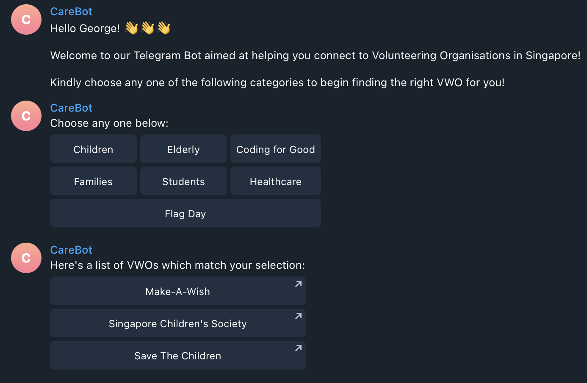
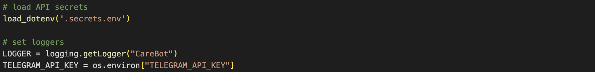

# CareBot


[](https://python.org "Python Homepage")

A simple Telegram bot that assists in pairing volunteers with a VWO that aligns with their interest.

[](assets/main_screen.pn)

## Installation

To install and run this file locally, create a `.env` file and place your secret Telegram API key in it.

To access this key in the code in `bot.py`, uncomment line 13, and replace the filename with the name of your `.env` file, and change line 17 to the name of your Telegram secret API key in your `.env` file, as seen below:



An example `.env` file should look like this:

```env
TELEGRAM_API_KEY=YOUR_KEY_HERE
```

After doing so, run the command `pip install -r requirements.txt` to install all requirements of this project. You should be doing this in a properly configured Python environment (venv or conda) to avoid dependency clashes.

If you are using an online service like Heroku to serve your app, you should store the variable as an environment variable on the service, and make an `os.getenv()` or `os.environ()` call to retrieve the environment variable, instead of storing and commit the API key onto Github.

## Usage

If you wish to run this bot locally on your machine, simply run `python bot.py`.

If you wish to use our instance of the bot hosted on Heroku, make sure that line 13 is commented out, and that the name of the variable in line 17 is replaced with `TELEGRAM_API_KEY`.

Our Telegram bot's link is: <https://t.me/life_hacked_bot>, and is hosted on <https://lifehack2022.herokuapp.com/>.
